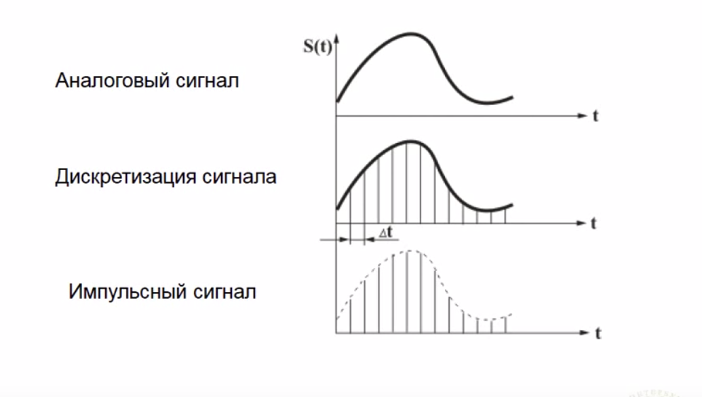

#### Аналого-цифровое и цифро-аналоговое преобразование в современных электронных устройствах.
##### Принцип их функционирование
---
- **Аналого-цифровое преобразование** заключается в преобразовании информации, содержащейся в аналоговом сигнале, в цифровой код.
- **Цифро-аналоговое преобразование** призвано выполнять обратную задачу, т.е. преобразовывать число, представленное в виде цифрового кода, в эквивалентный аналоговый сигнал
---
**Аналого-цифровое преобразование сигнала включает в себя два этапа:**
- Дискретизация сигнала (во времени или пространстве)
- Квантование по уровню
---
**Дискретизация сигнала**

