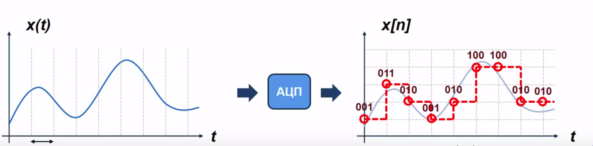
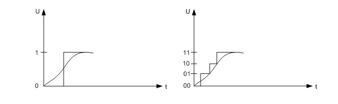

#### Аналого-цифровое и цифро-аналоговое преобразование в современных электронных устройствах.
##### Принцип их функционирование
---
- **Аналого-цифровое преобразование** - устройство преобразующее входной аналогой сигнал в дискретный код(цифровой сигнал). 
- **Цифро-аналоговое преобразование** - призвано выполнять обратную задачу, т.е. преобразовывать число, представленное в виде цифрового кода, в эквивалентный аналоговый сигнал. 
---
**Классификация АЦП**
- АЦП параллельного преобразования (параллельные АЦП);
- АЦП последовательного приближения;
- Последовательно -параллельные АЦП;
- Интегрирующие АЦП;
- Сигма-дельта АЦП
---
**АЦП сигнала включает в себя два этапа:**
- Дискретизация сигнала (во времени или пространстве)
- Квантование по уровню
 |
---
Дискретизация сигнала
- При дискретизации отсчета непрерывного сигнала берутся только в определенные моменты или дискреты времены.

---
**Квантование по уровню**
- При квантовании значение сигнала в эти моменты времени округляется до одного из фиксированных уровней. 
- Квантованный уровень затем представляется в двоичном виде 

- Количество уровней квантования определяется по формуле N=2^n
- n — количество разрядов
- N — уровень квантования
---
Выбор количества уровней квантования сигналов производится на основе компромиссного подхода, учитывающего с одной стороны необходимость достаточно точного представления сигнала, что требует большого числа уровней квантования, а с другой стороны количество уровней квантования должно быть меньше, что бы разрядность кода была минимальной.
---?include=assets/temp/PITCHME.md

---
**Цифро-аналоговое преобразование**
Цифро-аналоговые преобразователи являются интерфейсом между дискретным цифровым миром и аналоговыми сигналами
